# Word Block Translator

# Motors
## - Run Motor for Duration
### - Base

```python
motor = Motor('A')

motor.run_for_rotations(1, 75)
```
### - Multiple Motors

```python
motor_pair = MotorPair('A', 'E')

motor_pair.move_tank(1, 'rotations', -75, 75)
```
### - Counterclockwise

```python
motor = Motor('A')

motor.run_for_rotations(1, -75)
```
### - Degrees

```python
motor = Motor('A')

motor.run_for_degrees(1, 75)
```
### - Seconds

```python
motor = Motor('A')

motor.run_for_seconds(1, 75)
```
## - Motor Go to Position
### - Base

```python
motor = Motor('A')

motor.run_to_position(0, 'shortest path')
```
### - Multiple Motors

```python
motor_a = Motor('A')
motor_e = Motor('E')

motor_a.run_to_position(0, 'shortest path')
motor_e.run_to_position(0, 'shortest path')
```
### - Clockwise

```python
motor = Motor('A')

motor.run_to_position(0, 'clockwise')
```
### - Counterclockwise

```python
motor = Motor('A')

motor.run_to_position(0, 'counterclockwise')
```
## - Start Motor
### - Base

```python
motor = Motor('A')

motor.start(75)
```
### - Multiple Motors
TODO: Check if start_tank or just start is correct  

```python
motor_pair = MotorPair('A', 'E')

motor_pair.start_tank(75, -75)
```
### - Counterclockwise

```python
motor = Motor('A')

motor.start(-75)
```
## - Stop Motor
### - Base

```python
motor = Motor('A')

motor.stop()
```
### - Multiple Motors

```python
motor_pair = MotorPair('A', 'E')

motor_pair.stop()
```
## - Set Motor Speed
### - Base
TODO: Check that this works  

```python
motor = Motor('A')

motor.set_default_speed(75)
```
### - Multiple Motors

```python
motor_pair = MotorPair('A', 'E')

motor_pair.set_default_speed(75)
```
## - Motor Position

```python
motor = Motor('A')

motor.get_position()
```
## - Motor Speed

```python
motor = Motor('A')

motor.get_speed()
```
# Movement
## - Move for Duration
### - Base

```python
motor_pair = MotorPair('A', 'B')

motor_pair.move(10, 'cm')
```
### - Backwards 

```python
motor_pair = MotorPair('A', 'B')

motor_pair.move(-10, 'cm')
```
### - Counterclockwise

```python
motor_pair = MotorPair('A', 'B')

motor_pair.move(10, 'cm', -100)
```
### - Clockwise

```python
motor_pair = MotorPair('A', 'B')

motor_pair.move(10, 'cm', 100)
```
### - Inches

```python
motor_pair = MotorPair('A', 'B')

motor_pair.move(10, 'in')
```
### - Rotations

```python
motor_pair = MotorPair('A', 'B')

motor_pair.move(10, 'rotations')
```
### - Degrees

```python
motor_pair = MotorPair('A', 'B')

motor_pair.move(10, 'degrees')
```
### - Seconds

```python
motor_pair = MotorPair('A', 'B')

motor_pair.move(10, 'seconds')
```
## - Move with Steering for Duration
### - Base

```python
motor_pair = MotorPair('A', 'B')

motor_pair.move(10, 'cm', 42)
```
### - Inches

```python
motor_pair = MotorPair('A', 'B')

motor_pair.move(10, 'in', 42)
```
### - Rotations

```python
motor_pair = MotorPair('A', 'B')

motor_pair.move(10, 'rotations', 42)
```
### - Degrees

```python
motor_pair = MotorPair('A', 'B')

motor_pair.move(10, 'degrees', 42)
```
### - Seconds

```python
motor_pair = MotorPair('A', 'B')

motor_pair.move(10, 'seconds', 42)
```
## - Start Moving with Steering

```python
motor_pair = MotorPair('A', 'B')

motor_pair.start(42)
```
## - Stop Moving

```python
motor_pair = MotorPair('A', 'B')

motor_pair.stop()
```
## - Set Movement Speed

```python
motor_pair = MotorPair('A', 'B')

motor_pair.set_default_speed(50)
```
## - Set Movement Motors

```python
motor_pair = MotorPair('A', 'B')
```
## - Set 1 Motor Rotation to Distance Moved
### - Base

```python
motor_pair = MotorPair('A', 'B')

motor_pair.set_motor_rotation(17.5, 'cm')
```
### - Inches

```python
motor_pair = MotorPair('A', 'B')

motor_pair.set_motor_rotation(17.5, 'in')
```
# Light
## - Start Animation
  
TODO: Needs custom python code
## - Play Animation until Done
  
TODO: Needs custom python code
## - Turn On 5x5 Light Matrix for Seconds
  
```python
hub = MSHub()

hub.light_matrix.show_image('HAPPY') 
wait_for_seconds(2)
hub.light_matrix.off()
```
## - Turn On 5x5 Light Matrix
  
```python
hub = MSHub()

hub.light_matrix.show_image('HAPPY') 
```
## - Write on 5x5 Matrix
  
```python
hub = MSHub()

hub.light_matrix.write('Hello')
```
## - Turn off Pixels
  
```python
hub = MSHub()

hub.light_matrix.off()
```
## - Set Pixel Brightness
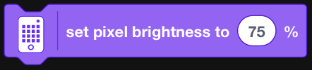  
TODO: Check if this block effects the 'Write' block   
Python equivalent is to set the brightness when calling the methods
## - Set Pixel
  
```python
hub = MSHub()

hub.light_matrix.set_pixel(1, 1, 100)
```
## - Rotate Orientation
  
TODO: Only possible with Mindstorms internal library
## - Set Orientation
  
TODO: Only possible with Mindstorms internal library
## - Set Center Button Light
  
```python
hub = MSHub()

hub.status_light.on('red')
```
## - Light Up Distance Sensor
  
```python
distance_sensor = DistanceSensor('A')

distance_sensor.light_up(100, 100, 100, 100)
```
# Sound
## - Play Sound until Done
  
```python

```
## - Start sound
  
```python

```
## - Play Beep for Seconds
  
```python

```
## - Start Playing Beep
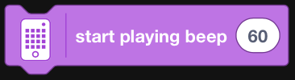  
```python

```
## - Stop All Sounds
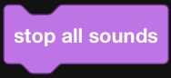  
```python

```
## - Change Pitch Effect by
### - Base
  
```python

```
### - Pan
  
```python

```
## - Set Pitch Effect to
### - Base
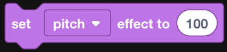  
```python

```
### - Pan
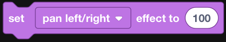  
```python

```
## - Clear Sound Effects
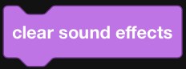  
```python

```
## - Change Volume
  
```python

```
## - Set Volume
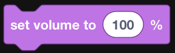  
```python

```
## - Volume
  
```python

```
# Events
## - When Program Starts
  
```python

```
## - When Color Is
  
```python

```
TODO: Add Button Pressed
## - When Closer Than
### - Base
  
```python

```
### - Farther than
  
```python

```
### - Exactly at
  
```python

```
### - Centimeters
  
```python

```
### - Inches
  
```python

```
## - When Hub Orientation Is Up
### - Base
  
```python

```
### - Back
  
```python

```
### - Top
  
```python

```
### - Bottom
  
```python

```
### - Right side
  
```python

```
### - Left side
  
```python

```
## - When Hub Shaken
### - Base
  
```python

```
### - Tapped
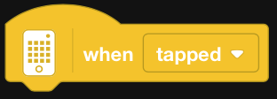  
```python

```
### - Falling
  
```python

```
## - When Hub Button Pressed
### - Base
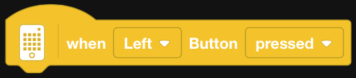  
```python

```
### - Right
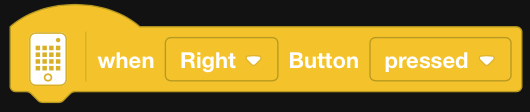  
```python

```
### - Released
  
```python

```
## - When
  
```python

```
## - When I Receive Message
  
```python

```
## - Broadcast Message
  
```python

```
## - Broadcast Message and Wait
  
```python

```
## - When Timer
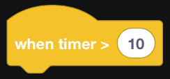  
```python

```
## - When Key Pressed
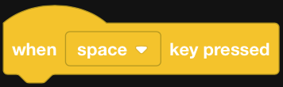  
```python

```
# Control
## - Wait for Seconds
  
```python

```
## - Wait Until
  
```python

```
## - Repeat Loop
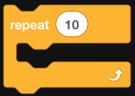  
```python

```
## - Forever Loop
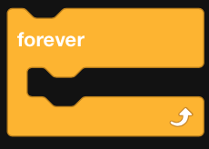  
```python

```
## - Repeat Until Loop
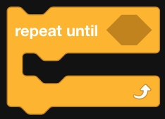  
```python

```
## - If Then
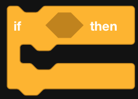  
```python

```
## - If Then Else
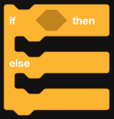  
```python

```
## - Stop other stacks
  
```python

```
## - Stop
### - Base  
  
```python

```
### - This stack  
  
```python

```
### - Exit Program  
  
```python

```
# Sensors
## - Is color?
  
```python

```
## - Color
  
```python

```
## - Is reflected light?
### - Base
  
```python

```
### - Equal
  
```python

```
### - Greater than
  
```python

```
## - Reflected Light
  
```python

```
## - Is distance?
### - Base
  
```python

```
### - Farther than
  
```python

```
### - Exactly at
  
```python

```
### - Centimeters
  
```python

```
### - Inches
  
```python

```
## - Distance
### - Base
  
```python

```
### - Centimeters
  
```python

```
### - Inches
  
```python

```
## - Gesture
  
```python

```
## - Is Hub Shaken?
### - Base
  
```python

```
### - Tapped
  
```python

```
### - Falling
  
```python

```
## - Is Hub orientation?
### - Base
  
```python

```
### - Back
  
```python

```
### - Top
  
```python

```
### - Bottom
  
```python

```
### - Right Side
  
```python

```
### - Left Side
  
```python

```
## - Hub Orientation
  
```python

```
## - Set Hub Yaw Angle to 0
  
```python

```
## - Is Hub Button pressed?
### - Base
  
```python

```
### - Right
  
```python

```
### - Released
  
```python

```
## - Hub Pitch Roll Yaw Angle
### - Base
  
```python

```
### - Roll
  
```python

```
### - Yaw
  
```python

```
## - Timer
  
```python

```
## - Reset Timer
  
```python

```
## - Key Pressed
  
```python

```
# Operators
## - Pick Random Number
## - Plus
## - Minus
## - Multiply
## - Divide
## - Greater Than
## - Less Than
## - Equal
## - And
## - Or
## - Not
## - Is Between
## - Join Strings
## - Letter of String
## - Length of String
## - String Contains
## - Mod
## - Round
## - Math Functions
# Variables
## - Variable
## - Set Variable To
## - Change Variable By
## - List
## - Add Item to List
## - Delete Item in List
## - Delete All Items in List
## - Insert Item at Index in List
## - Replace  item at Index in List with Another Item
## - Value of Item in List
## - Length of List
## - List contains
